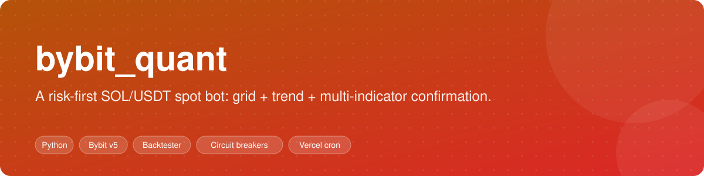
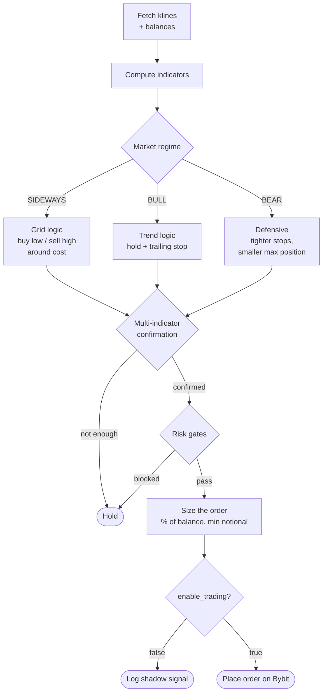
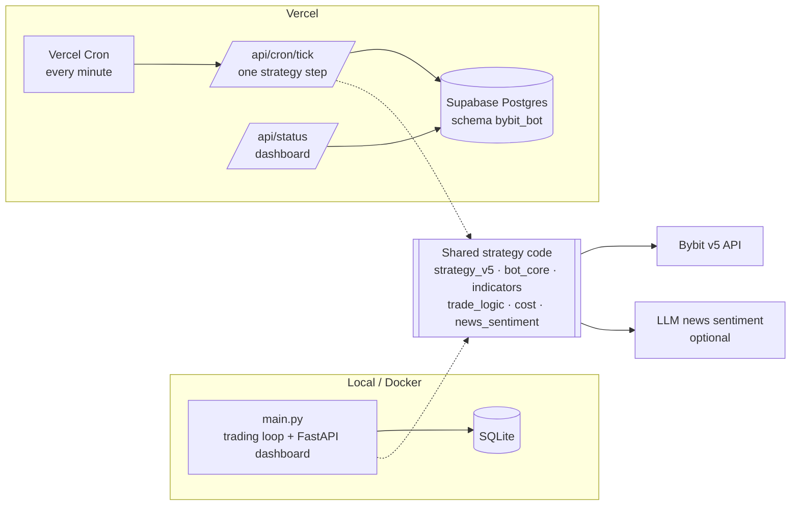

<div align="center">



# bybit_quant

**A risk-first spot trading bot for Bybit.** Grid trading for sideways markets, trend-following for real moves, multi-indicator confirmation before every order, and circuit breakers that stop it from buying all the way down a crash.
Runs as a local process with a live web dashboard, or serverless on Vercel Cron — same strategy code in both.


[Strategy](#strategy) · [Risk controls](#risk-controls) · [Quick start](#quick-start) · [Backtest](#backtesting) · [Deploy on Vercel](#deploy-on-vercel)

</div>

> [!WARNING]
> **This is experimental software, not financial advice.** Crypto trading can lose all of the money you put in. Run it in **shadow mode** (`enable_trading: false`) until you understand every decision it makes, start with an amount you can afford to lose, and use an API key **without withdrawal permission**.

---

## Why another bot

Most open-source grid bots do one thing well — buy the dip — and one thing catastrophically: **keep buying the dip while the market falls 40%.** This project started as a grid bot on SOL/USDT and was rebuilt around one lesson from its own losses: *capital preservation first, profit second.* The full post-mortem that drove v5 is in [`STRATEGY_IMPROVEMENTS.md`](STRATEGY_IMPROVEMENTS.md).

## Features

- **Market-regime detection** — classifies the market as `BULL`, `BEAR` or `SIDEWAYS` from trend strength, moving averages and volatility, and switches behaviour per regime.
- **Grid + trend hybrid** — grid entries in ranges, trend-following with trailing stops in real moves.
- **Multi-indicator confirmation** — SMA 7/12/24/72, EMA 9/21, RSI 7/14, MACD, Bollinger Bands, ATR, Stochastic RSI, volume, momentum, support/resistance and volatility percentile.
- **Circuit breakers** — daily drawdown halt, BTC-crash gate, loss cooldowns and per-day order limits (see [Risk controls](#risk-controls)).
- **Cost-aware exits** — tracks the real average cost of the position from fill history, including fees, and only takes profit past a minimum edge.
- **News sentiment (optional)** — an LLM scores recent crypto news from −100 to +100, cached for 30 minutes, as one more input.
- **Adaptive-exit shadow diagnostics** — an ATR "Chandelier" trailing stop is computed alongside every decision *without trading on it*, so you can compare it with real fills before switching it on.
- **Backtester** — replays historical klines through the exact live strategy code with simulated time.
- **Web dashboard** — positions, signals, trades, cost basis and bilingual (EN / 中文) news summary; mobile-friendly.
- **Two deployments, one brain** — a long-running local process, or Vercel Cron + Supabase Postgres.

## Strategy



Every decision — including the ones that end in *hold* — is written to the signal log with its reasons, which is what the dashboard shows.

## Risk controls

The v5 rewrite added gates that act **before** any order is sized:

| Control | What it does |
|---|---|
| **Daily drawdown circuit breaker** | If the portfolio loses more than 5% in a day, all trading halts for 24 hours. |
| **BTC crash gate** | If BTC falls more than 3% in a day, grid *buying* is disabled — a BTC crash is a gate, not just a weaker signal. |
| **Faster regime switching** | Switches regime as soon as confidence exceeds 0.6, so the bot stops buying earlier in a downturn. |
| **Bear-market limits** | Tighter stop-loss and a lower maximum position in `BEAR`. |
| **Consecutive-buy cap** | Limits how many buys can stack before a sell. |
| **Re-entry threshold** | After a stop-loss, price must move further before it buys back. |
| **Cooldowns & order limits** | Cooldown after a loss, and a maximum number of orders per symbol per day (`risk` in the config). |

## Architecture



The Vercel version reuses the strategy modules unchanged; only the storage layer is swapped for a Postgres implementation with the same function signatures.

## Quick start

**Requirements:** Python 3.11+, a Bybit account with a **spot-only API key, no withdrawal permission**.

```bash
git clone https://github.com/agent-room-alkl/bybit_quant.git
cd bybit_quant
python -m venv .venv && source .venv/bin/activate   # Windows: .venv\Scripts\activate
pip install -r requirements.txt
cp config.example.json config.json
```

Edit `config.json` — **set `"enable_trading": false` first** (the example ships with it `true`):

```jsonc
{
  "testnet": false,
  "api_key": "YOUR_BYBIT_API_KEY",
  "api_secret": "YOUR_BYBIT_API_SECRET",
  "symbols": ["SOLUSDT"],
  "enable_trading": false,          // shadow mode: signals only, no orders
  "buy_pct_of_usdt": 0.25,
  "risk":     { "max_daily_loss_pct": 3.0, "max_orders_per_symbol_per_day": 4, "cooldown_after_loss_min": 60 },
  "strategy": { "grid_spacing_pct": 1.5, "stop_loss_pct": 3.0, "trailing_stop_pct": 2.0, "rsi_period": 14 },
  "gpt_api_key": ""                 // optional: news sentiment
}
```

Run the bot and dashboard together:

```bash
python main.py
```

The dashboard is at <http://localhost:5555>. Helper scripts `start.sh`, `stop.sh`, `restart.sh` and `status.sh` manage it as a background process, and `quant-trader.service` is a ready-made systemd unit.

<details>
<summary><b>Docker</b></summary>

```bash
docker compose up -d --build
```

`config.json`, `data/` and `logs/` are mounted from the host. Note: the compose file publishes port `8000`, while the dashboard listens on `5555` — adjust the port mapping to `5555:5555` if you want to reach it from the host.

</details>

## Backtesting

```bash
python backtest.py
```

The backtester feeds historical klines through the same `SmartStrategy` used live, with a simulated clock (`set_simulated_time`), so cooldowns, circuit breakers and regime switching behave exactly as they would in production. `backtest_trend.py` runs the trend-only strategy for comparison, and `analyze_signals.py` summarises a signal log.

## Deploy on Vercel

The `vercel/` directory turns the bot into **Vercel Cron + serverless functions**, storing all state in Supabase Postgres (schema `bybit_bot`):

| Route | Purpose |
|---|---|
| `GET /api/cron/tick` | One strategy step: read market → compute signal → optionally order → write to Postgres. Guarded by `CRON_SECRET` and an execution lock so ticks never overlap. |
| `GET /api/status` | Read-only dashboard and health check. Set `STATUS_SECRET` to hide trade details from the public. |

Safe defaults: `enable_trading` is `false` unless `ENABLE_TRADING=true` is set; a missing `CRON_SECRET` or a lock error makes the tick **refuse to run** rather than risk a duplicate order. Minute-level cron needs a Vercel Pro plan. Full steps: [`vercel/README.md`](vercel/README.md).

## Project layout

```
main.py              local entry point: trading loop + FastAPI dashboard
bot_core.py          one strategy step per symbol: data → signal → order → log
strategy_v5.py       SmartStrategy: regimes, grid/trend logic, circuit breakers
indicators.py        SMA, EMA, RSI, MACD, Bollinger, ATR, Stoch RSI, S/R, volatility
trade_logic.py       instrument filters, position sizing, order generation, RiskManager
cost.py              average cost basis from fill history
news_sentiment.py    optional LLM news score, cached
risk_modules/        adaptive exit (shadow diagnostics) + tests
bybit_client.py      signed Bybit v5 REST client
backtest*.py         backtesting engines
vercel/              serverless deployment (cron tick, status, Postgres storage)
```

## Safety checklist

- [ ] API key is **spot-only, no withdrawals**, ideally IP-restricted.
- [ ] Ran in shadow mode (`enable_trading: false`) and read the signal log for at least a few days.
- [ ] Backtested on a period that includes a sharp drawdown.
- [ ] Set `risk.max_daily_loss_pct` to an amount you accept losing.
- [ ] `config.json` is **never** committed (it is in `.gitignore`).

## Disclaimer

For education and research. Nothing here is investment advice. Past performance, backtested or live, does not predict future results. You are solely responsible for any trades this software places with your keys.

---

If this saved you from writing your own grid bot the hard way, a ⭐ helps others find it.
